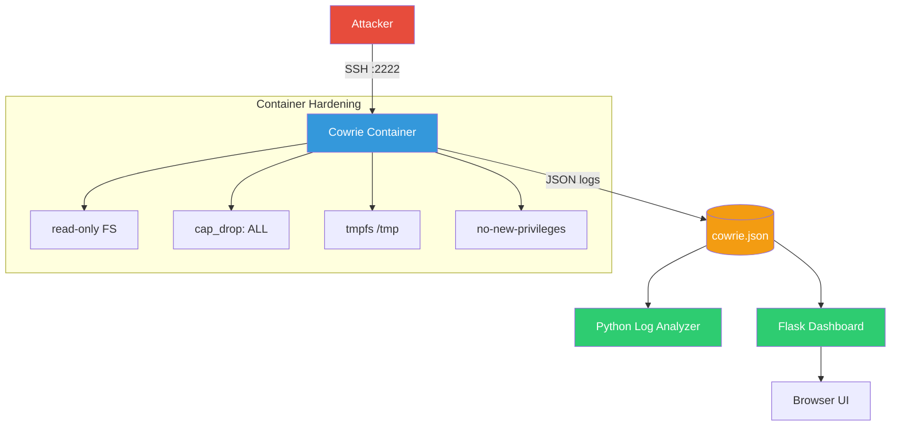

# Cowrie Honeypot — Attack Capture & Analysis Platform

[](LICENSE)
[](https://python.org)
[](https://docker.com)
[](https://github.com/psf/black)

A production-style SSH/Telnet honeypot using [Cowrie](https://github.com/cowrie/cowrie) in Docker, with Python-based log analysis and a visualization dashboard.

> **Educational Purpose Only** — Designed for defensive cybersecurity research. Only deploy on systems you own or have explicit permission to monitor.

---

## Architecture



## Quick Start

```bash
# Start the honeypot
cd docker && docker compose up -d

# Test the connection
ssh root@localhost -p 2222

# Analyze captured logs
python scripts/log_analyzer.py

# Launch dashboard
python dashboard/app.py
# Open http://127.0.0.1:5000
```

## Features

- **SSH/Telnet honeypot** — Full protocol emulation, realistic fake filesystem
- **Attack telemetry** — Every login, command, and file download captured
- **Security hardened** — Container with `read_only`, `cap_drop ALL`, `no-new-privileges`
- **Network contained** — Outbound traffic disabled, isolated Docker subnet
- **Log analyzer** — Python tool for attack statistics and session replay
- **Flask dashboard** — Real-time charts for credentials, IPs, and commands
- **Attack simulator** — Generate test data to validate the pipeline

## Project Structure

```
basic-honeypot/
├── docker/              # Container deployment & Cowrie configuration
│   ├── docker-compose.yml
│   └── cowrie/etc/      # Read-only Cowrie config
├── scripts/             # Python analysis tools
├── dashboard/           # Flask web dashboard
├── config/              # Shared configuration
├── tests/               # Unit tests (pytest)
├── docs/                # Documentation with Mermaid diagrams
├── logs/                # Archived log storage
├── assets/              # Screenshots and diagrams
├── report/              # Analysis reports
└── .github/workflows/   # CI/CD pipeline
```

## Security

| Layer | Protection |
|-------|-----------|
| **Capabilities** | `cap_drop: ALL` — no kernel capabilities granted |
| **Filesystem** | `read_only: true` — container is immutable |
| **Privileges** | `no-new-privileges:true` — can't escalate |
| **Temp space** | `tmpfs` — all temp data in RAM, wiped on restart |
| **Network** | Outbound traffic disabled, isolated subnet |
| **Config** | Cowrie configuration mounted read-only (`:ro`) |

## Tech Stack

| Component | Technology |
|-----------|------------|
| Honeypot | Cowrie (Python/Twisted) |
| Container | Docker + Docker Compose |
| Log format | JSON Lines |
| Analysis | Python 3.12+ |
| Dashboard | Flask + Chart.js |
| Testing | pytest |

## License

MIT License — see [LICENSE](LICENSE)
