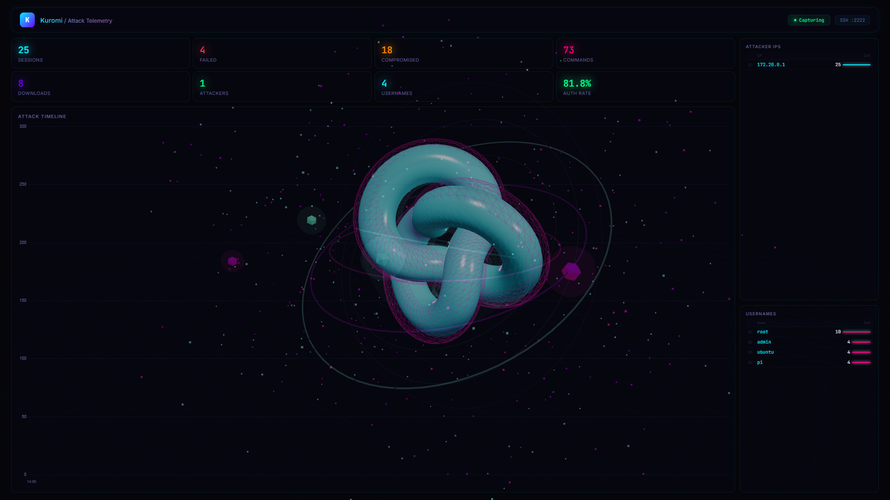

# Kuromi — SSH Honeypot with 3D Cyberpunk Dashboard

[](https://python.org)
[](https://docker.com)
[](LICENSE)
[](https://github.com)
[](https://github.com)

> **Kuromi** — A real-time SSH honeypot with a cyberpunk 3D dashboard. Catch attackers, visualize attacks in 3D, and analyze their tools. Works on Windows & Linux.



---

## Quick Start

### 🐳 Using Docker (recommended — works on any OS)

```bash
git clone https://github.com/shwetakanth09/honeypot-project.git
cd honeypot-project/docker
docker compose up -d
```

Open **http://localhost:5000** — the 3D dashboard is live!

### 🪟 Windows (without Docker)

```powershell
cd honeypot-project
python dashboard\app.py
```

Open **http://127.0.0.1:5000**

### 🐧 Linux (without Docker)

```bash
cd honeypot-project
python3 dashboard/app.py
```

Open **http://127.0.0.1:5000**

---

## What It Does

| Step | What happens |
|------|-------------|
| 1 | Cowrie honeypot listens on port **2222** for SSH attacks |
| 2 | Every connection, login attempt, and command is logged to `cowrie.json` |
| 3 | Flask dashboard reads the log and serves a **3D cyberpunk UI** |
| 4 | Stats update every 5 seconds — attackers, passwords, commands, timeline |

---

## 3D Dashboard Features

- **Torus knot** — Central animated 3D shape with pulsing emissive glow
- **Wireframes** — Dual counter-rotating wireframe overlays
- **Orbiters** — 5 icosahedrons orbiting at different speeds and radii
- **Constellation** — 500 particles with dynamic connecting lines (edge detection)
- **Glow rings** — 8 glowing rings at varying angles
- **Stars** — 2000 background stars for depth
- **Mouse parallax** — Camera follows cursor smoothly
- **Chart.js timeline** — Attack event timeline graph
- **Stats cards** — Sessions, failed logins, compromised, commands, downloads
- **Tables** — Top attackers, top usernames with bar indicators

---

## Project Structure

```
honeypot-project/
├── docker/                  # Docker deployment
│   ├── docker-compose.yml   # Cowrie + Dashboard services
│   └── cowrie/              # Cowrie config and logs
├── dashboard/               # Flask web dashboard
│   ├── app.py               # Flask backend (API + serve HTML)
│   ├── Dockerfile           # Container build file
│   └── templates/index.html # 3D cyberpunk UI with Three.js
├── scripts/                 # Python analysis tools
│   ├── log_analyzer.py      # Attack report generator
│   ├── simulate_attacks.py  # Generate test attack data
│   └── dump_logs.py         # Raw log viewer
├── tests/                   # Unit tests
├── assets/                  # Screenshots
└── .github/workflows/       # CI pipeline
```

---

## Commands

```bash
# Analyze captured attacks (terminal report)
python scripts/log_analyzer.py

# View raw logs
python scripts/dump_logs.py

# Generate simulated SSH attacks (requires paramiko)
pip install paramiko
python scripts/simulate_attacks.py

# Docker: view live logs
cd docker
docker compose logs -f dashboard
docker compose logs -f cowrie

# Docker: rebuild after code changes
docker compose build dashboard
docker compose up -d
```

---

## Architecture

```
Attacker ──SSH :2222──> Cowrie (honeypot) ──logs──> cowrie.json ──reads──> Dashboard (Flask) ──> Browser 3D UI
```

- Cowrie runs in a hardened container: read-only FS, no capabilities, no privilege escalation
- Dashboard container shares the log volume via bind mount
- Works cross-platform: all paths auto-detect from script location

---

## License

MIT
