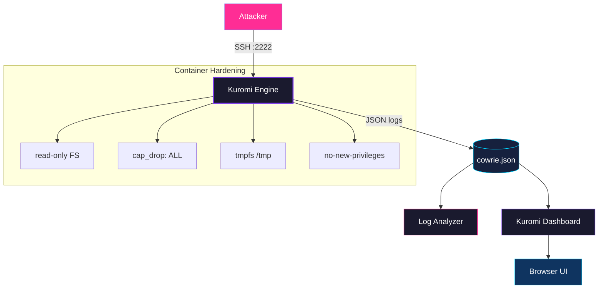

# Kuromi — Honeypot Attack Capture & Analysis

[](LICENSE)
[](https://python.org)
[](https://docker.com)
[](https://github.com)

> **Kuromi** — A dark, elegant SSH honeypot platform. Watch attackers in real-time. Learn their tools. Stay ahead.

---

## Architecture



## Quick Start

```bash
# Start Kuromi
cd docker && docker compose up -d

# Test the trap
ssh root@localhost -p 2222

# Analyze logs
python scripts/log_analyzer.py

# Launch dashboard
python dashboard/app.py
# Open http://127.0.0.1:5000
```

## Features

- **SSH/Telnet honeypot** — Full protocol emulation with realistic fake filesystem
- **Attack telemetry** — Every login, command, and file download captured in JSON
- **Security hardened** — Container with `read_only`, `cap_drop ALL`, `no-new-privileges`
- **Network contained** — Outbound traffic disabled, isolated Docker subnet
- **Log analyzer** — Python tool for attack statistics and session replay
- **Kuromi Dashboard** — Cyberpunk-themed real-time attack visualization
- **Attack simulator** — Generate test data to validate the pipeline

## Project Structure

```
kuromi/
├── docker/              # Container deployment
├── scripts/             # Python analysis tools
├── dashboard/           # Kuromi web dashboard
├── config/              # Shared configuration
├── tests/               # Unit tests (pytest)
├── docs/                # Documentation
├── logs/                # Archived attack data
├── assets/              # Screenshots and diagrams
├── report/              # Analysis reports
└── .github/workflows/   # CI/CD pipeline
```

## Security

| Layer | Protection |
|-------|-----------|
| **Capabilities** | `cap_drop: ALL` — no kernel capabilities |
| **Filesystem** | `read_only: true` — immutable container |
| **Privileges** | `no-new-privileges:true` — no escalation |
| **Temp space** | `tmpfs` — RAM-only, wiped on restart |
| **Network** | Outbound disabled, isolated subnet |
| **Config** | Mounted read-only (`:ro`) |

## License

MIT — See [LICENSE](LICENSE)
