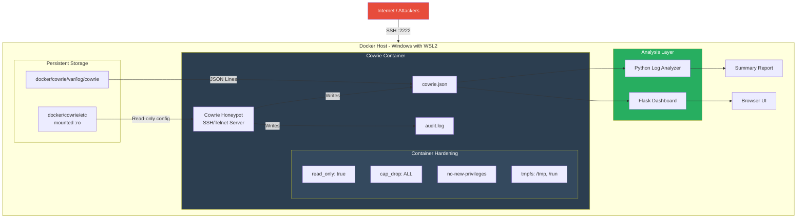
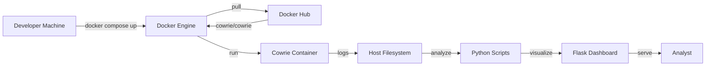

# Architecture Documentation

## System Overview



## Data Flow

1. **Attacker** connects to port 2222 (SSH) or 2223 (Telnet)
2. **Cowrie** accepts the connection, presents a fake Ubuntu shell
3. Every interaction is logged as JSON events to `cowrie.json`
4. **Log Analyzer** (`scripts/log_analyzer.py`) reads the JSON file and produces statistics
5. **Dashboard** (`dashboard/app.py`) serves a web UI with real-time charts

## Security Architecture

### Container Isolation

| Layer | Protection |
|-------|------------|
| **Capabilities** | `cap_drop: ALL` - No kernel capabilities granted |
| **Filesystem** | `read_only: true` - Container FS is immutable |
| **Privileges** | `no-new-privileges:true` - Can't run setuid binaries |
| **Temp Space** | `tmpfs` - All temp data in RAM, wiped on restart |
| **Network** | Outbound traffic disabled in Cowrie config |

### Network Isolation

- Cowrie runs on an isolated Docker network (`honeynet`, subnet 172.20.0.0/24)
- Only ports 2222 and 2223 are exposed to the host
- Outbound connections are blocked by Cowrie configuration

### Data Protection

- All logs are stored outside the container (bind mount)
- Configuration files are mounted read-only (`:ro`)
- No real credentials are used (accepts any login attempt)

## Component Details

### Cowrie Configuration (`docker/cowrie/etc/cowrie.cfg`)

```ini
[honeypot]
listen_endpoints = tcp:2222:interface=0.0.0.0
hostname = ubuntu-server

[database_jsonlog]
enabled = true
logfile = ${honeypot:log_path}/cowrie.json

[network]
outbound_enabled = false
```

### Log Format (JSON Lines)

Each event is a single JSON object on one line:

```json
{
  "eventid": "cowrie.login.success",
  "username": "root",
  "password": "toor",
  "src_ip": "10.0.0.1",
  "session": "abc123",
  "timestamp": "2026-07-14T14:20:53.000000Z"
}
```

### Event Types

| Event ID | Description |
|----------|-------------|
| `cowrie.session.connect` | New connection received |
| `cowrie.client.version` | SSH client version string |
| `cowrie.client.kex` | Key exchange details (HASSH fingerprint) |
| `cowrie.login.success` | Successful login |
| `cowrie.login.failed` | Failed login attempt |
| `cowrie.command.input` | Command executed in fake shell |
| `cowrie.session.file_download` | File download attempt |
| `cowrie.session.closed` | Connection closed |

## Deployment Architecture



## File Reference

| Path | Purpose |
|------|---------|
| `docker/docker-compose.yml` | Container orchestration |
| `docker/cowrie/etc/cowrie.cfg` | Cowrie configuration |
| `docker/cowrie/var/log/cowrie/` | Log storage |
| `scripts/log_analyzer.py` | Log analysis engine |
| `scripts/simulate_attacks.py` | Attack simulation tool |
| `dashboard/app.py` | Flask web dashboard |
| `tests/test_analyzer.py` | Unit tests |
| `.github/workflows/ci.yml` | CI/CD pipeline |

## Future Considerations

1. **Multi-container** - Add ELK stack (Elasticsearch, Logstash, Kibana) for centralized logging
2. **Threat Intelligence** - Feed captured IPs to blocklists (AbuseIPDB, etc.)
3. **Alerting** - Email/Slack notifications on attack detection
4. **Database** - Store logs in PostgreSQL/SQLite instead of flat files
5. **Nginx Reverse Proxy** - Add rate limiting and SSL termination
6. **Real SSH Redirection** - Use iptables to redirect port 22 traffic to the honeypot
