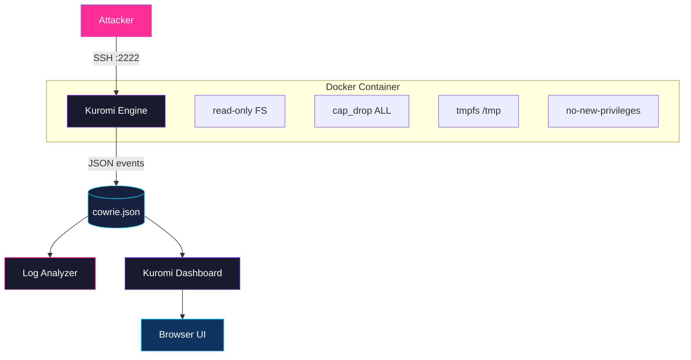

# Kuromi — Architecture

## System Overview

## Data Flow

1. **Attacker** connects to port 2222 (SSH) or 2223 (Telnet)
2. **Kuromi (Cowrie)** accepts the connection, presents a fake Ubuntu shell
3. Every interaction is logged as JSON events to `cowrie.json`
4. **Log Analyzer** reads the JSON and produces statistics
5. **Kuromi Dashboard** serves the cyberpunk web UI with real-time charts

## Security

| Layer | Protection |
|-------|-----------|
| **Capabilities** | `cap_drop: ALL` — No kernel capabilities |
| **Filesystem** | `read_only: true` — Container FS is immutable |
| **Privileges** | `no-new-privileges:true` — Can't run setuid |
| **Temp Space** | `tmpfs` — RAM only, wiped on restart |
| **Network** | Outbound disabled, isolated subnet 172.20.0.0/24 |
| **Config** | Config mounted `:ro` (read-only) |

## File Reference

| Path | Purpose |
|------|---------|
| `docker/docker-compose.yml` | Container orchestration |
| `docker/cowrie/etc/cowrie.cfg` | Cowrie configuration |
| `docker/cowrie/var/log/cowrie/` | Log storage |
| `scripts/log_analyzer.py` | Log analysis engine |
| `scripts/simulate_attacks.py` | Attack simulation tool |
| `dashboard/app.py` | Kuromi Flask dashboard |
| `tests/test_analyzer.py` | Unit tests |
